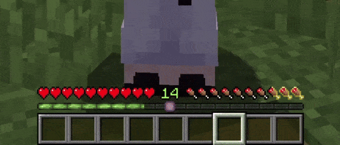
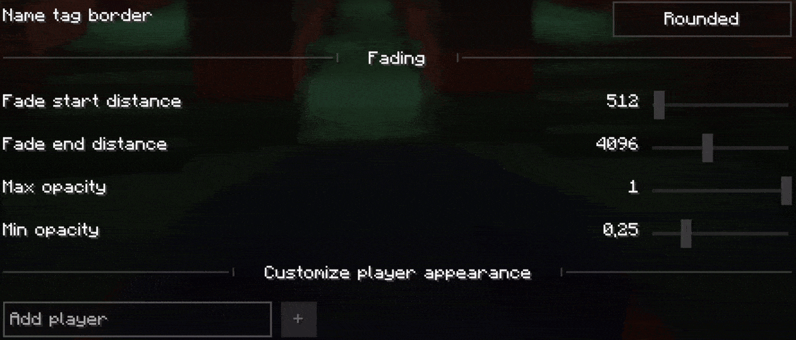

<h1 align="center">Better Player Locator Bar</h1>

    
    
    
    
    

Better Player Locator Bar is a Fabric mod. It shows players in a HUD bar above the XP bar. You can customize icons, borders, fades, and more.

## 🎯 Features

- HUD bar with icons representing nearby players and death markers
- Customizable icon style: `default`, `minimal`, `mojang`, `bowtie (shift + click)`
- Icon border styles: `rounded` or `squared`
- Option to show player names and heads
- Vertical arrows when height difference is significant by player camera or position
- Distance-based fading (configurable start, end, alpha min/max)
- Smooth interpolation using easing
- Asset detection: scans included textures in `sprites/hud/`
- Client/server sync via handshake and position payloads; fallback to local mode
- Config UI (`F8` in game or use `ModMenu`), preview, per-player overrides (color, icon, border...)
- Death markers persistence and cleanup

## 📸 Gallery

    <blockquote>A preview of how you would see other players with the mod</blockquote>
    
    <blockquote>A preview of a player on the HUD</blockquote>
    
    <blockquote>A preview of two players on the HUD</blockquote>
    
    <blockquote>This would be a preview of the settings screen so you can customize it as much as you want</blockquote>
    
    <blockquote>Now you can customize your friends icons</blockquote>
    

## Requirements

- Minecraft 1.21 - 1.21.1
- Fabric Loader ≥ 0.14.2
- Java 21
- Fabric API

## Installation

1. Install Fabric Loader and Fabric API
2. Place `better-player-locator-bar-1.1.0-fabric+1.21(.1)mc.jar` into your `mods/` folder
3. Run Minecraft

## Known Issues & Limitations

- Only works in Fabric, no Forge/NeoForge/... support (yet? 🥀)

## License

The contents of this repository and mod, are licensed under a <a href="LICENSE">Creative Commons Attribution-NonCommercial-ShareAlike 4.0 International License</a>. ([Canonical URL](https://creativecommons.org/licenses/by-nc-sa/4.0/))
